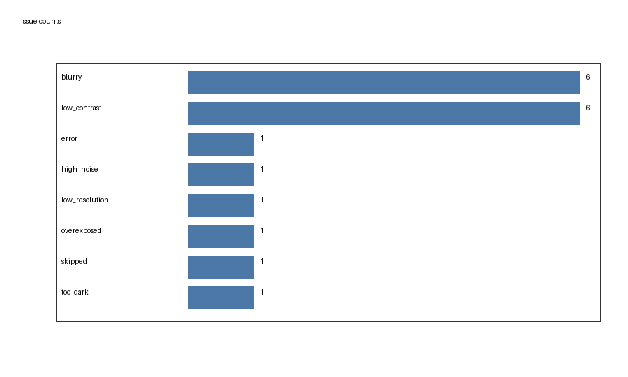
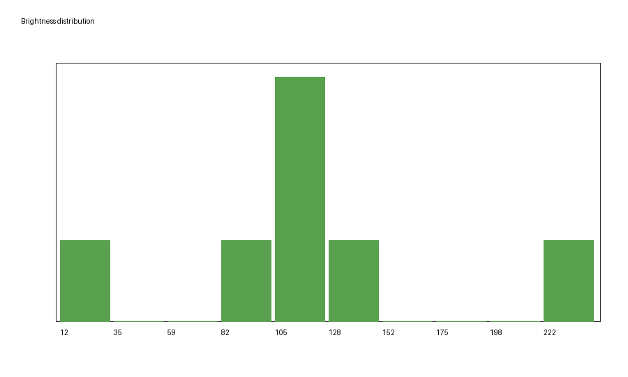
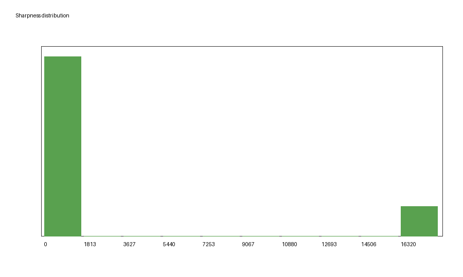

# 图像质量检测报告

## 汇总
- 总文件数: 9
- 有效图像数: 7
- 跳过的非图像文件数: 1
- 损坏或读取失败文件数: 1

## 问题类型统计
- blurry: 6
- low_contrast: 6
- high_noise: 1
- low_resolution: 1
- overexposed: 1
- too_dark: 1

## 图表
- 
- 
- 

## 明细预览
| 文件名 | 状态 | 亮度 | 对比度 | 清晰度 | 噪声 | 分辨率 | 问题 |
|---|---:|---:|---:|---:|---:|---:|---|
| blurry.bmp | ok | 127.5 | 0.7822 | 12.5437 | 0.5055 | 128x128 | blurry;low_contrast |
| corrupt.png | error |  |  |  |  | x |  |
| high_noise.png | ok | 127.6201 | 29.9882 | 18133.0762 | 28.2787 | 128x128 | high_noise |
| low_resolution.png | ok | 120.0 | 0.0 | 0.0 | 0.0 | 24x24 | blurry;low_contrast;low_resolution |
| normal.png | ok | 130.0 | 0.0 | 0.0 | 0.0 | 128x128 | blurry;low_contrast |
| notes.txt | skipped |  |  |  |  | x |  |
| overexposed.jpg | ok | 245.0 | 0.0 | 0.0 | 0.0 | 96x96 | overexposed;blurry;low_contrast |
| too_dark.png | ok | 12.0 | 0.0 | 0.0 | 0.0 | 96x96 | too_dark;blurry;low_contrast |
| 中文文件名.png | ok | 100.0 | 0.0 | 0.0 | 0.0 | 96x96 | blurry;low_contrast |

## 结论
- 过暗、过曝、模糊、低对比度、高噪声和低分辨率由阈值规则自动判断。
- 阈值适合课堂作业和快速巡检；实际生产环境应结合业务样本重新标定。
